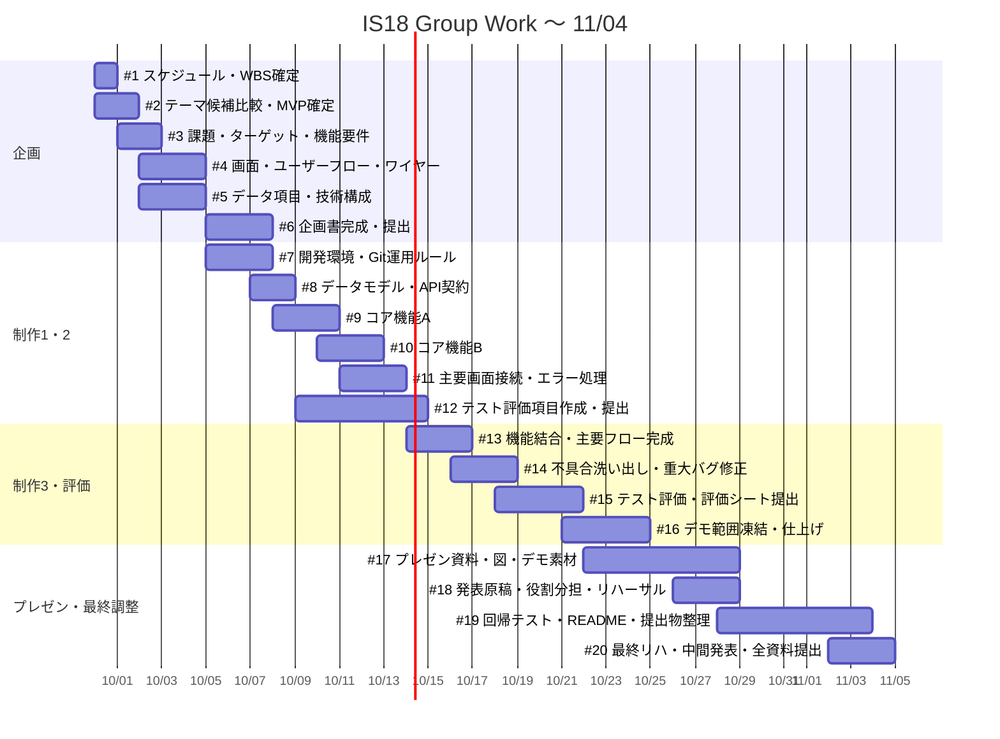

# 11月4日までのガントチャート

対象期間: **2026-09-30〜2026-11-04**

授業の提出日から逆算し、GitHub Issues #1〜#20 と対応させている。

## 学校側の節目

- **09/30** スケジュール提出
- **10/07** 企画書提出
- **10/14** テスト評価項目提出
- **10/21** 評価シート提出
- **10/28** プレゼン資料を完成状態にする
- **11/04** 中間プレゼン / 課題全資料提出

## GitHub Projects の日付

各Issue本文に以下を記載済み。

- **Start**: Roadmap の Start date
- **Target**: Roadmap の Target date
- **Priority**: High
- **Depends on**: 先行Issue

テーマ確定後、#9「コア機能A」と #10「コア機能B」は実際の機能名に変更する。
