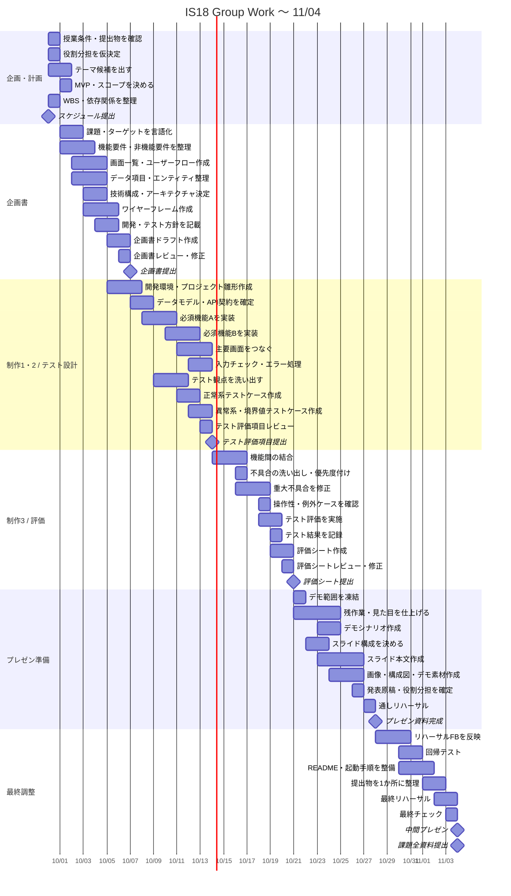

# 11月4日までのガントチャート

対象期間: **2026-09-30〜2026-11-04**

授業予定に合わせて、提出物から逆算して作業を細分化したもの。
テーマ固有の「必須機能A/B」は、テーマ決定後に実際の機能名へ置き換える。

## 学校側の節目

- **09/30** オリエンテーション / スケジュール作成 / 制作企画 → スケジュール提出
- **10/07** 企画書作成・制作1 → 企画書提出
- **10/14** 制作2 → テスト評価項目提出
- **10/21** 制作3 → 評価シート提出
- **10/28** プレゼンテーション資料作成
- **11/04** 中間テスト（プレゼンテーション） → 課題全資料提出

## Gantt

## タスク一覧

| # | タスク | 開始 | 期日 | 完了条件 |
|---:|---|---|---|---|
| 1 | 授業条件・提出物を確認 | 09/30 | 09/30 | 11/04までの提出物と締切が一覧化されている |
| 2 | 役割分担を仮決定 | 09/30 | 09/30 | PM/実装/資料などの担当が仮置きされている |
| 3 | テーマ候補を3案以上出す | 09/30 | 10/01 | 比較可能な候補が最低3案ある |
| 4 | テーマを1案に決定 | 10/01 | 10/01 | 採用案と理由が文章化されている |
| 5 | MVP・スコープ決定 | 10/01 | 10/01 | Must / Should / 今回やらない が分かれている |
| 6 | WBS・依存関係整理 | 09/30 | 09/30 | 作業順と締切が決まっている |
| 7 | スケジュール提出 | 09/30 | 09/30 | 学校指定形式で提出済み |
| 8 | 課題・ターゲット言語化 | 10/01 | 10/02 | 誰の何を解決するか1〜3文で説明できる |
| 9 | 機能要件整理 | 10/01 | 10/03 | 必須機能が列挙されている |
| 10 | 非機能要件整理 | 10/02 | 10/03 | 性能/使いやすさ/安全性等の最低条件がある |
| 11 | 画面一覧作成 | 10/02 | 10/03 | 必要画面が漏れなく一覧化されている |
| 12 | ユーザーフロー作成 | 10/02 | 10/04 | 開始から目的達成までの操作順が分かる |
| 13 | データ項目・エンティティ整理 | 10/02 | 10/04 | 保存するデータと関係が説明できる |
| 14 | 技術構成決定 | 10/03 | 10/04 | FE/BE/DB/外部サービス等が確定している |
| 15 | ワイヤーフレーム作成 | 10/03 | 10/05 | 主要画面の配置と操作が確認できる |
| 16 | 開発・テスト方針作成 | 10/04 | 10/05 | ブランチ/レビュー/テスト方法が決まっている |
| 17 | 企画書ドラフト | 10/05 | 10/06 | 必須項目がすべて埋まっている |
| 18 | 企画書レビュー・修正 | 10/06 | 10/06 | 誤字・矛盾・説明不足を解消 |
| 19 | 企画書提出 | 10/07 | 10/07 | 提出済み |
| 20 | 開発環境・雛形作成 | 10/05 | 10/07 | 全員が起動できる |
| 21 | データモデル/API契約確定 | 10/07 | 10/08 | 入出力とデータ構造が実装可能な粒度 |
| 22 | 必須機能A実装 | 10/08 | 10/10 | 単体で動作確認できる |
| 23 | 必須機能B実装 | 10/10 | 10/12 | 単体で動作確認できる |
| 24 | 主要画面接続 | 10/11 | 10/13 | 主要フローが最初から最後まで通る |
| 25 | バリデーション・エラー処理 | 10/12 | 10/13 | 主要な不正入力で破綻しない |
| 26 | テスト観点洗い出し | 10/09 | 10/11 | 正常/異常/境界/連携の観点がある |
| 27 | 正常系テストケース作成 | 10/11 | 10/12 | 操作・期待結果が明記されている |
| 28 | 異常系・境界値テストケース作成 | 10/12 | 10/13 | 主要な失敗パターンを網羅 |
| 29 | テスト評価項目レビュー | 10/13 | 10/13 | 重複・漏れをチームで確認済み |
| 30 | テスト評価項目提出 | 10/14 | 10/14 | 提出済み |
| 31 | 機能間結合 | 10/14 | 10/16 | 主要フローが統合環境で動く |
| 32 | 不具合洗い出し・優先度付け | 10/16 | 10/16 | Critical/High/Low等で整理済み |
| 33 | 重大不具合修正 | 10/16 | 10/18 | 発表を妨げる不具合が残っていない |
| 34 | 操作性・例外ケース確認 | 10/18 | 10/18 | 主要な迷いやすさ・例外を確認済み |
| 35 | テスト評価実施 | 10/18 | 10/19 | テストケースを一通り実施済み |
| 36 | テスト結果記録 | 10/19 | 10/19 | OK/NGと根拠が残っている |
| 37 | 評価シート作成 | 10/19 | 10/20 | 指定項目が埋まっている |
| 38 | 評価シートレビュー | 10/20 | 10/20 | 内容をチームで確認済み |
| 39 | 評価シート提出 | 10/21 | 10/21 | 提出済み |
| 40 | デモ範囲を凍結 | 10/21 | 10/21 | 以降は新機能追加より完成度を優先 |
| 41 | 残作業・見た目を仕上げる | 10/21 | 10/24 | デモ対象の完成度が十分 |
| 42 | デモシナリオ作成 | 10/23 | 10/24 | 失敗しにくい操作順が決まっている |
| 43 | スライド構成決定 | 10/22 | 10/23 | 課題→提案→実装→評価→まとめ の流れがある |
| 44 | スライド本文作成 | 10/23 | 10/26 | 全ページに内容が入っている |
| 45 | 画像・構成図・デモ素材作成 | 10/24 | 10/26 | 発表に必要な視覚素材が揃っている |
| 46 | 発表原稿・役割分担確定 | 10/26 | 10/26 | 誰がどこを話すか決まっている |
| 47 | 通しリハーサル | 10/27 | 10/27 | 時間計測と改善点記録が済んでいる |
| 48 | プレゼン資料完成 | 10/28 | 10/28 | 原則内容凍結できる状態 |
| 49 | リハーサルFB反映 | 10/28 | 10/30 | 指摘事項を反映済み |
| 50 | 回帰テスト | 10/30 | 10/31 | 修正による既存機能の破壊がない |
| 51 | README・起動手順整備 | 10/30 | 11/01 | 初見でも起動手順が分かる |
| 52 | 提出物を1か所に整理 | 11/01 | 11/02 | 企画書/テスト/評価/資料等が揃っている |
| 53 | 最終リハーサル | 11/02 | 11/03 | 制限時間内で安定して発表できる |
| 54 | 最終チェック | 11/03 | 11/03 | リンク切れ/ファイル漏れ/デモ不具合なし |
| 55 | 中間プレゼン | 11/04 | 11/04 | 発表完了 |
| 56 | 課題全資料提出 | 11/04 | 11/04 | 学校指定の全資料を提出済み |

## GitHub Projects に入れるとき

Roadmapでは次のフィールドを使う。

- **Status**: Todo / In Progress / Done
- **Assignees**: 担当者
- **Start date**: 上表の開始日
- **Target date**: 上表の期日
- **Priority**: High / Medium / Low

提出タスク（#7, #19, #30, #39, #48, #55, #56）は Priority = High 推奨。

### 運用ルール

- 1タスクは原則 **半日〜2日程度** で完了できるサイズにする。
- 3日を超える実装タスクは、実際の機能名でさらに Issue 分割する。
- 「必須機能A/B」はテーマ確定後に **具体的な機能名へ置換**する。
- 発表1週間前の10/28以降は、原則として新機能追加を止め、品質・資料・デモ安定性を優先する。
